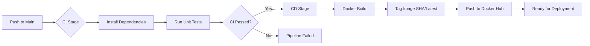

# 🚀 Node.js CI/CD Pipeline with GitHub Actions & Docker
This project demonstrates a robust **Continuous Integration and Continuous Deployment (CI/CD) workflow for a Node.js Express application. It automates the entire lifecycle from code commit to container image distribution.

### 🛠 Tech Stack
- **Runtime**: Node.js (v20)

- **Automation**: GitHub Actions

- **Containerization**: Docker

- **Registry**: Docker Hub

## 🏗 Pipeline Architecture

The workflow is architected into two distinct stages to ensure only verified code reaches production:

### 1. Continuous Integration (CI)

**Unit Testing**: Automatically installs dependencies and runs npm test on every push to the main branch.

**Validation**: Ensures code integrity before triggering deployment.

### 2. Continuous Deployment (CD)

**Conditional Execution**: Only triggers upon a successful CI stage.

**Security**: Utilizes GitHub Secrets for encrypted Docker Hub authentication.

**Artifact Management**: Builds, tags (using Commit SHA for traceability), and pushes the image to the Docker Hub registry.

 ## 📊 Pipeline Flow

## ⚙️ Configuration & Security
To replicate this environment, configure the following GitHub Actions Secrets:

**DOCKER_USERNAME**: Your Docker Hub identity.

**DOCKER_PASSWORD**: Personal Access Token (PAT) for enhanced security.

